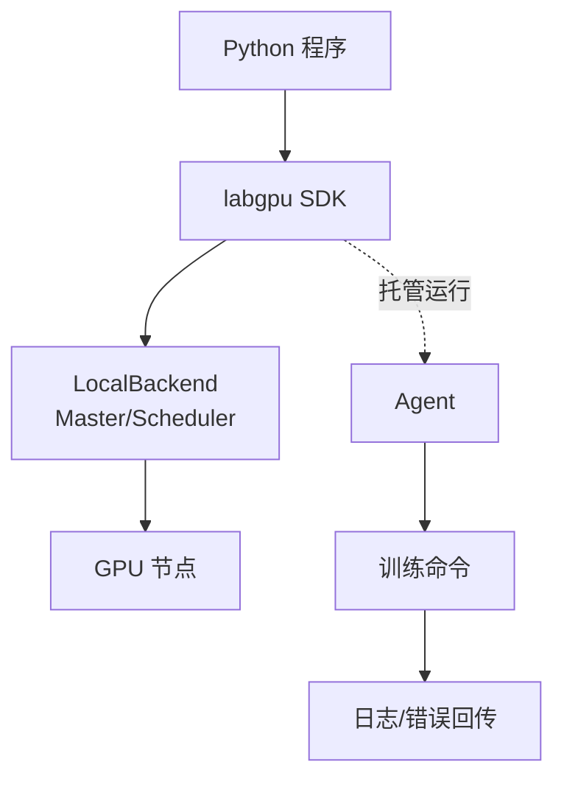

# Lab-GPU-Commander (lab-gpu)

这是一个可运行的实验室 GPU 调度器 Demo：包含 Python CLI、内存版 Master/Agent、基础调度策略、OOM 自愈，以及 VS Code 插件骨架。核心逻辑已经配齐 pytest 测试，适合继续扩展为分布式系统。

## 功能概览
- 多级优先级 + 公平共享调度（High/Normal/Low）
- 智能回填（基于 time limit 的回填门控）
- 夜间策略加速 Low 队列（night boost）
- OOM 语义解析与自动回填升级显存需求
- 僵尸进程检测（低利用率 + 无 IO）
- 抢占流程（SIGUSR1 → SIGTERM → SIGKILL）
- Textual TUI 看板（支持 kill / retry / top）
- VS Code 右键提交 + 状态栏轮询 + OOM 提示



## 安装

```
python -m pip install .
```

环境要求：
- Python 3.10+

可选依赖：

```
python -m pip install ".[test]"
python -m pip install ".[server]"  # FastAPI 可选依赖，后续扩展 API 用
python -m pip install "pyyaml"      # 读取 policy.yaml 时可用（未安装时走简易解析）
```

## 仓库结构
- `lab_gpu/`：核心逻辑（CLI / Master / Scheduler / Agent / TUI）
- `tests/`：pytest 测试
- `examples/`：GPU 负载示例脚本
- `vscode/`：VS Code 插件源码
- `logs/`：本地日志示例目录（默认日志不写这里）

## CLI 快速开始
注册节点、提交任务并触发调度：

```
lab-gpu server start --role master --host 127.0.0.1
lab-gpu server add-node --name node-1 --gpus 2 --vram 24 --gpu-type "RTX 3090"
lab-gpu submit --mem 10G --priority normal "python train.py"
lab-gpu server tick
lab-gpu status
```

Dry-run（只模拟分配，不提交）：

```
lab-gpu submit --mem 10G --priority high --dry-run "python train.py"
```

Agent 本地执行（带日志 + OOM 解析）：

```
lab-gpu agent run --task-id 1 --mem-used 10 --env my-conda "python train.py"
```

如未安装入口脚本，可用模块方式运行：

```
python -m lab_gpu.cli status
```

日志查看：

```
lab-gpu logs 1
lab-gpu logs 1 -f
```

抢占运行中的任务：

```
lab-gpu server preempt --task-id 1 --soft-timeout 300 --term-timeout 30
```

## 命令速查
- `lab-gpu server start --role master`：启动（demo 模式，仅本地内存）
- `lab-gpu server add-node ...`：注册节点与 GPU 数量
- `lab-gpu submit --mem 10G --priority normal "cmd"`：提交任务
- `lab-gpu submit --mem 10G --dry-run "cmd"`：仅模拟分配（返回 JSON）
- `lab-gpu server tick`：执行一次调度
- `lab-gpu status` / `--json`：查看状态
- `lab-gpu logs <id> [-f]`：查看任务日志
- `lab-gpu server preempt --task-id <id>`：软/硬抢占
- `lab-gpu agent run --task-id <id> --mem-used 10 "cmd"`：本地执行 + OOM 解析
- `lab-gpu tui`：TUI 看板

## 日志与权限
- Agent 默认写日志到 `/nas/logs/{task_id}.log`，可用 `--log-root` 改路径。
- 若无权限创建目录，`agent run` 会报错并退出。

## Policy 文件（夜间模式）
示例 `policy.yaml`：

```
night_start: "00:00"
night_end: "08:00"
base_idle_util_threshold: 0.05
night_idle_util_threshold: 0.20
backfill_time_limit_s: 3600
night_low_bonus: 0.5
```

加载策略：

```
lab-gpu server start --role master --policy policy.yaml
```

## TUI 交互
启动：

```
lab-gpu tui
```

快捷键：
- `k`：杀死选中的任务
- `r`：重试选中的任务
- `t`：提升选中任务到队首
- `q`：退出

命令行输入框：
- `list`：切换列表模式
- `top <id>`：将指定任务提升到队首

## VS Code 插件说明
`vscode/extension.ts` 已实现：
- 右键 “Submit to GPU Queue”
- 自动记忆上次显存输入
- 状态栏轮询 `lab-gpu status --json`
- OOM 自动重试弹窗提示
- QuickPick 查看运行中任务并打开日志

可选配置（工作区根目录）：
`.labgpu_config.json`
```
{
  "default_mem": "10G"
}
```

插件安装（源码构建）：
```
cd vscode
npm install
npm run compile
```

调试运行：
- VS Code 打开 `vscode/` 目录，按 `F5` 启动 Extension Development Host

打包 VSIX：
```
cd vscode
npm install
npm run compile
npx vsce package
```

安装 VSIX：
```
code --install-extension lab-gpu-0.0.1.vsix
```

更详细说明见：`vscode/README.md`

## 测试

```
pytest -q
```

覆盖范围：
- 回填策略（头阻塞时允许小任务先跑）
- OOM 自愈策略（显存升级 + retry 计数）
- 公平调度排序
- 僵尸进程检测

## 示例显存程序（手动测试）
目录：`examples/`

- `gpu_alloc.py`：申请固定显存并保持一段时间
- `gpu_oom.py`：逐步申请显存触发 OOM（支持 mock）
- `gpu_burst.py`：周期性申请/释放显存
- `gpu_sleep.py`：申请显存后长时间空转

示例命令（需要 PyTorch + CUDA）：

```
python examples/gpu_alloc.py --gb 2 --sleep 20
python examples/gpu_burst.py --gb 1 --cycles 3
python examples/gpu_sleep.py --gb 4 --sleep 120
```

无需 PyTorch/GPU 的 mock 模式：

```
python examples/gpu_alloc.py --mock --gb 0.5
python examples/gpu_burst.py --mock --gb 0.5 --cycles 2
python examples/gpu_sleep.py --mock --gb 0.5 --sleep 5
```

模拟 OOM（无需 GPU）：

```
python examples/gpu_oom.py --mock-oom
```

与 lab-gpu 联动（本地 demo）：

```
lab-gpu server add-node --name node-1 --gpus 1 --vram 24
lab-gpu submit --mem 2G --priority normal "python examples/gpu_alloc.py --gb 2 --sleep 30"
lab-gpu server tick
lab-gpu agent run --task-id 1 --mem-used 2 "python examples/gpu_alloc.py --gb 2 --sleep 30"
```

模拟 OOM 回路（无需 GPU）：

```
python -m lab_gpu.cli agent run --task-id 99 --mem-used 10 --log-root ./logs "python examples/gpu_oom.py --mock-oom"
```

## 批量提交（JSON）
新增命令：
```
lab-gpu submit-batch --file tasks.json
lab-gpu submit-batch --file tasks.json --dry-run
```

支持两种 JSON 格式：

1) 直接是数组
```
[
  {"cmd": "python train_a.py", "mem": "10G", "priority": "normal"},
  {"cmd": "python train_b.py", "mem": "12G", "priority": "high", "time_limit": 1200}
]
```

2) 顶层对象包含 `tasks`
```
{
  "tasks": [
    {"cmd": "python train_a.py", "mem": "10G"},
    {"cmd": "python train_b.py", "min_vram_gb": 8, "gpu_type": "RTX 3090"}
  ]
}
```

字段说明：
- `cmd`：必填，命令字符串
- `mem`：显存需求，例 `"10G"`
- `min_vram_gb`：显存需求（数字），与 `mem` 二选一
- `priority`：`high|normal|low`，默认 `normal`
- `env`：可选 Conda 环境名
- `gpu_type`：可选 GPU 型号匹配
- `time_limit`：秒，用于回填策略

## 说明
- 当前是单进程 Demo：Master/Agent 运行在同一 CLI 进程中。
- 调度与状态全部在内存中，无持久化、无多节点通信。
- GPU 利用率/僵尸进程判定逻辑仅在内存结构中模拟，不采集真实 GPU 指标。
- 日志默认写入 `/nas/logs/{task_id}.log`，可通过 `agent run --log-root` 改路径。
